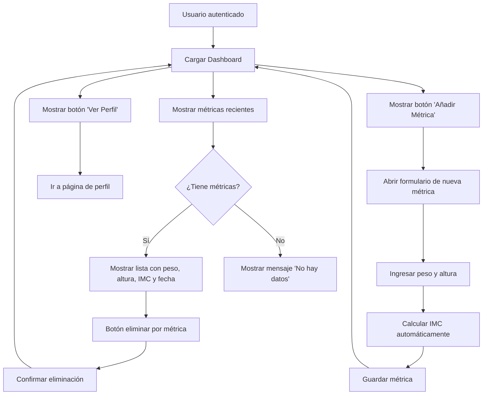
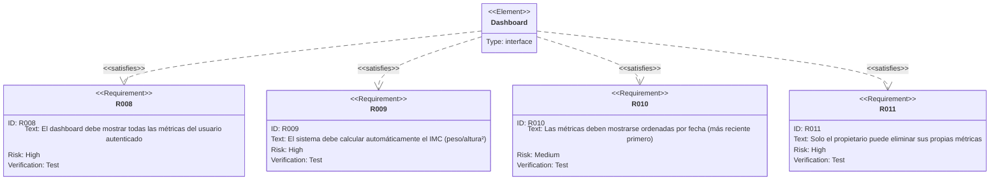

# Mockup: Dashboard Principal

## Diagrama de Flujo del Dashboard



## Requisitos del Dashboard



## Mockup de la Interfaz del Dashboard

```
┌─────────────────────────────────────────────────────┐
│  StatTracker 📊          Usuario: Juan Pérez  [🚪]  │
├─────────────────────────────────────────────────────┤
│  [+ Añadir Métrica]  [👤 Ver Perfil]                │
├─────────────────────────────────────────────────────┤
│  Mis Métricas de Salud                              │
│  ┌───────────────────────────────────────────────┐ │
│  │ Fecha      Peso    Altura   IMC      [Acciones]│ │
│  │ 2025-01-15 75 kg   1.75 m   24.5     [🗑️]      │ │
│  │ 2025-01-10 76 kg   1.75 m   24.8     [🗑️]      │ │
│  │ 2025-01-05 77 kg   1.75 m   25.1     [🗑️]      │ │
│  └───────────────────────────────────────────────┘ │
└─────────────────────────────────────────────────────┘
```

## Formulario de Añadir Métrica

```
┌─────────────────────────────────────┐
│  Añadir Nueva Métrica               │
│                                     │
│  Peso (kg):                         │
│  [__________]                       │
│                                     │
│  Altura (m):                        │
│  [__________]                       │
│                                     │
│  IMC: [Calculado automáticamente]   │
│                                     │
│  [  Guardar  ]  [  Cancelar  ]      │
└─────────────────────────────────────┘
```
