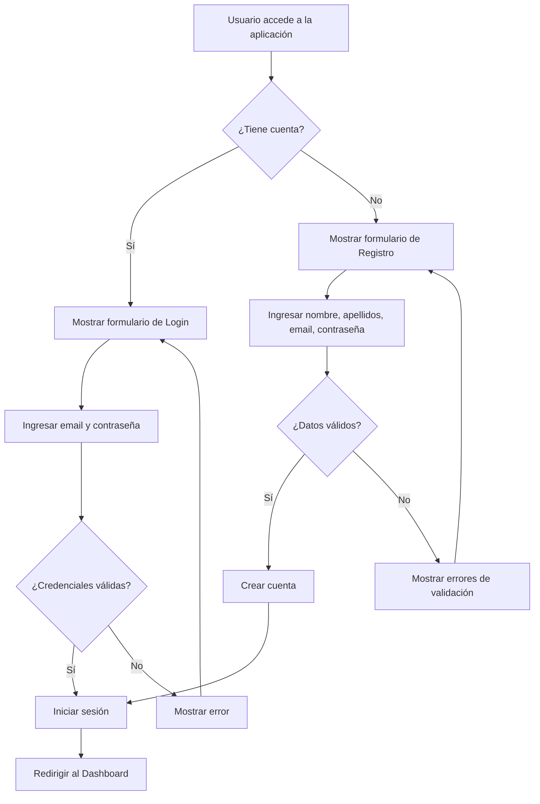
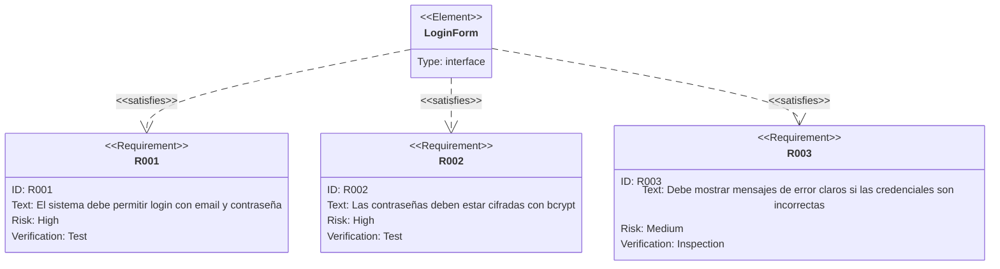

# Mockup: Pantalla de Login y Registro

## Diagrama de Flujo de Autenticación



## Requisitos de la Pantalla de Login



## Mockup de la Interfaz de Login

```
┌─────────────────────────────────────────┐
│         StatTracker 📊                  │
│                                         │
│  ┌───────────────────────────────────┐ │
│  │  Email:                           │ │
│  │  [____________________________]   │ │
│  │                                   │ │
│  │  Contraseña:                      │ │
│  │  [____________________________]   │ │
│  │                                   │ │
│  │  [  Iniciar Sesión  ]             │ │
│  │                                   │ │
│  │  ¿No tienes cuenta? Regístrate    │ │
│  └───────────────────────────────────┘ │
└─────────────────────────────────────────┘
```

## Requisitos de Registro

```mermaid
requirementDiagram

    requirement R004 {
        id: R004
        text: El formulario de registro debe solicitar nombre, apellidos, email y contraseña
        risk: high
        verifymethod: test
    }

    requirement R005 {
        id: R005
        text: El email debe ser único en el sistema
        risk: high
        verifymethod: test
    }

    requirement R006 {
        id: R006
        text: Debe validar formato de email
        risk: medium
        verifymethod: test
    }

    requirement R007 {
        id: R007
        text: La contraseña debe tener al menos 6 caracteres
        risk: medium
        verifymethod: test
    }

    element RegisterForm {
        type: interface
    }

    RegisterForm - satisfies -> R004
    RegisterForm - satisfies -> R005
    RegisterForm - satisfies -> R006
    RegisterForm - satisfies -> R007
```
