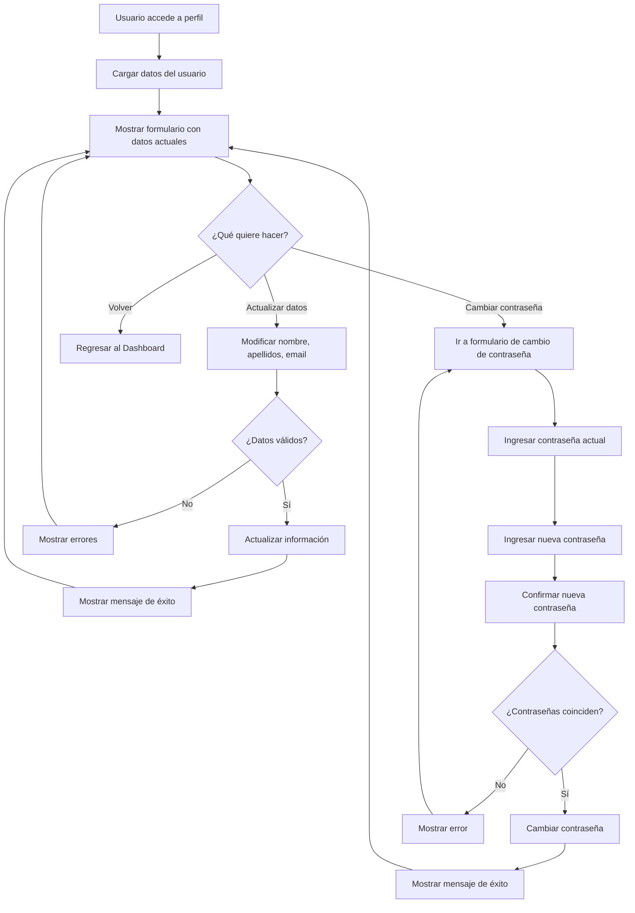

# Mockup: Gestión de Perfil

## Diagrama de Flujo del Perfil



## Requisitos de Gestión de Perfil

```mermaid
requirementDiagram

    requirement R012 {
        id: R012
        text: El usuario debe poder actualizar su nombre, apellidos y email
        risk: high
        verifymethod: test
    }

    requirement R013 {
        id: R013
        text: El sistema debe validar que el nuevo email no esté en uso por otro usuario
        risk: high
        verifymethod: test
    }

    requirement R014 {
        id: R014
        text: El usuario debe poder cambiar su contraseña proporcionando la actual
        risk: high
        verifymethod: test
    }

    requirement R015 {
        id: R015
        text: El sistema debe verificar que la contraseña actual sea correcta antes de cambiarla
        risk: high
        verifymethod: test
    }

    requirement R016 {
        id: R016
        text: Las nuevas contraseñas deben coincidir y tener al menos 6 caracteres
        risk: medium
        verifymethod: test
    }

    element ProfilePage {
        type: interface
    }

    ProfilePage - satisfies -> R012
    ProfilePage - satisfies -> R013
    ProfilePage - satisfies -> R014
    ProfilePage - satisfies -> R015
    ProfilePage - satisfies -> R016
```

## Mockup de la Interfaz de Perfil

```
┌─────────────────────────────────────────────────────┐
│  StatTracker 📊          Usuario: Juan Pérez  [🚪]  │
├─────────────────────────────────────────────────────┤
│  [← Volver al Dashboard]                            │
├─────────────────────────────────────────────────────┤
│  Mi Perfil                                          │
│                                                     │
│  ┌───────────────────────────────────────────────┐ │
│  │ Datos Personales                              │ │
│  │                                               │ │
│  │ Nombre:                                       │ │
│  │ [Juan                     ]                   │ │
│  │                                               │ │
│  │ Apellidos:                                    │ │
│  │ [Pérez García             ]                   │ │
│  │                                               │ │
│  │ Email:                                        │ │
│  │ [juan.perez@example.com   ]                   │ │
│  │                                               │ │
│  │ [  Actualizar Perfil  ]                       │ │
│  └───────────────────────────────────────────────┘ │
│                                                     │
│  ┌───────────────────────────────────────────────┐ │
│  │ Cambiar Contraseña                            │ │
│  │                                               │ │
│  │ Contraseña actual:                            │ │
│  │ [____________________________]                │ │
│  │                                               │ │
│  │ Nueva contraseña:                             │ │
│  │ [____________________________]                │ │
│  │                                               │ │
│  │ Confirmar nueva contraseña:                   │ │
│  │ [____________________________]                │ │
│  │                                               │ │
│  │ [  Cambiar Contraseña  ]                      │ │
│  └───────────────────────────────────────────────┘ │
└─────────────────────────────────────────────────────┘
```
